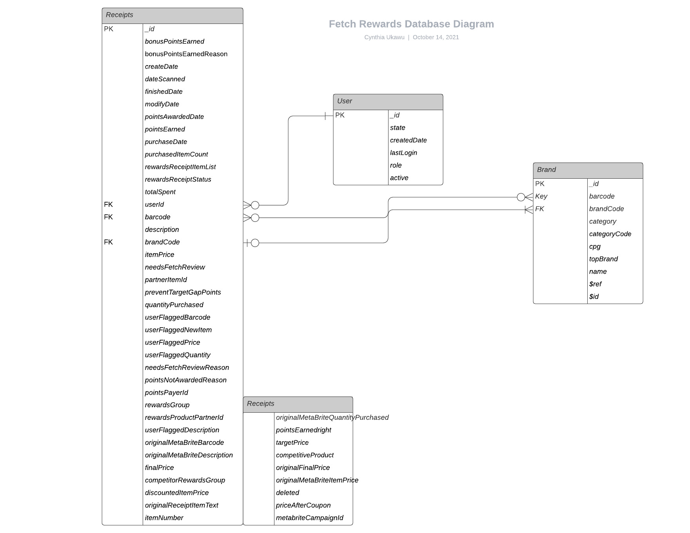
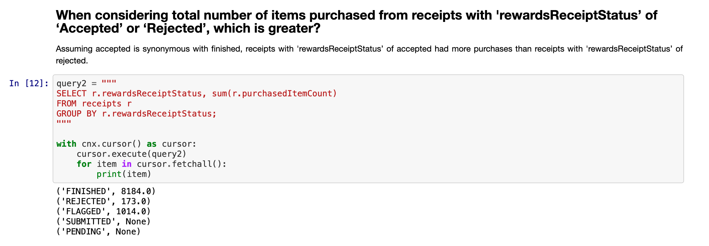
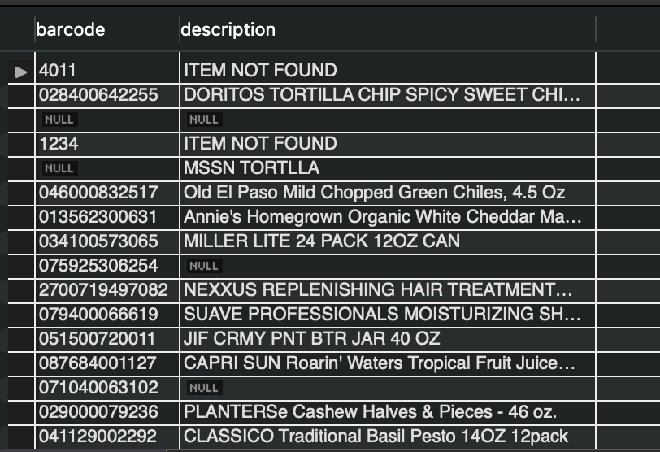

# This README contains the written part of the assessment.

## Part 1: Database Design

## Part 2: Query the Database
The complete code is located in the [Fetch_Rewards.ipynb](https://github.com/cynthiiaa/fetch_rewards/blob/main/Fetch_Rewards.ipynb) file.
Here's a screenshot of a response to one of the questions:

## Part 3: Evaluate Data Quality Issues
When working with data, I first look for incompleteness and invalidity. I used SQL to execute a few GROUP BY statements to see if the values for certain fields align with what's to be expected. Unfortunately, there were many rows where values were either incorrect or missing. I'll show two examples.

`SELECT role FROM users
GROUP BY role;`

In the Users table, the value **CONSUMER** is expected, but *FETCH-STAFF* is also found. So those users with *FETCH-STAFF* as role need to be reevaluated.

`SELECT barcode, description FROM receipts
GROUP BY barcode, description`

Some of the items from the Receipt table had either a missing barcode or an **ITEM NOT FOUND** description.

There were also redundancies with the various price columns from the Receipt table.

## Part 4: Communicate with Stakeholders

> Hi team,
>
> I recently finished analyzing the zipped JSON files for Receipts, Users, and Brands and noticed a few things.
> 1. Nested JSONs were found in both the Receipts and Brands file.
> Parsing through nested data can lead to an increase in error, and it also slows down the execution of the code. If possible, could we have the rewardsReceiptItemList column, found in the Receipts file, and the CPG column, located in the Brands file, expanded beforehand?
> 2. For the Users table, 82 users had 'FETCH-STAFF' as the role. As well as duplicate ids for several records within the Users table. I also noticed that the most recently created user dates back to February 12th, but it's currently October 14th. That's a little over eight months of missing records.
> 3. There were many incomplete rows for Receipts and Brands and redundant columns found in the Receipts table.
>
> I have many questions like:
> How is the data entered for Receipts, Users, and Brands?
> How should I handle empty values? Would you like me to remove those rows with empty values, or should I replace them with fillers?
> Which columns can we remove from the Receipts table?
>
> But we should set up some time to go over this; my availability is flexible this week and next week. Feel free to CC anyone who is interested or can add input to this thread.
>
> Thanks,
>
> Cynthia Ukawu

