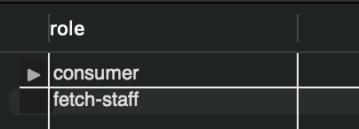

This README file will contain the written part of the assessment.

## Part 1: Database Design

## Part 2: Query the Database
The full code is located in the [Fetch_Rewards.ipynb](https://github.com/cynthiiaa/fetch_rewards/blob/main/Fetch_Rewards.ipynb) file.
Here's a screenshot of a response to one of the questions:

## Part 3: Evaluate Data Quality Issues
When working with data I first look for incompleteness and invalidity. I used SQL to do execute a few GROUP BY statments to see if the values for certain fields align with what's to be expected. Unfortunately, there were many rows where values were either incorrect or missing. I'll show two examples.

`SELECT role from users
GROUP BY role;`

In the Users table, the value **CONSUMER** is expected but *FETCH-STAFF* is also found. So those users with *FETCH-STAFF* as role need to be reevaluated.

`SELECT barcode, description from receipts
GROUP BY barcode, description`

Some of the items from the Receipt table had either a missing barcode or an **ITEM NOT FOUND** description.

There were also redundancies with the various price columns from the Receipt table.

## Part 4: Communicate with Stakeholders
